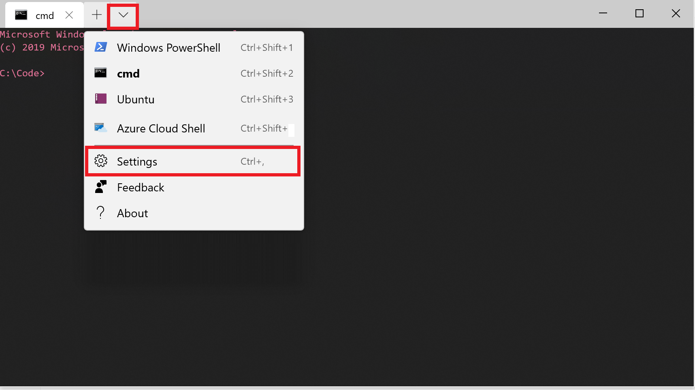

Here are the steps to add Anaconda Prompt to Windows Terminal

## Prerequisites
- [Install Windows Terminal](https://www.microsoft.com/en-us/p/windows-terminal-preview/9n0dx20hk701?activetab=pivot:overviewtab)
- [Install Anaconda](https://www.anaconda.com/distribution/)
- Windows 10

## Steps to Add Anaconda Prompt
1. Open Windows Terminal and click the arrow and then `settings`. This will open the `profiles.json` file to customize the terminal.

2. Duplicate the cmd.exe settings by coping and pasting them below below (or highlight + CTRL + D if you are visual studio to duplicate the selected text) 

```json
,
    {
      "acrylicOpacity": 1.0,
      "closeOnExit": true,
      "colorScheme": "Campbell",
      "commandline": "cmd.exe",
      "cursorColor": "#FFFFFF",
      "cursorShape": "bar",
      "fontFace": "Consolas",
      "fontSize": 10,
      "guid": "{0caa0dad-35be-5f56-a8ff-afceeeaa6105}",
      "historySize": 9001,
      "icon": "ms-appx:///ProfileIcons/{0caa0dad-35be-5f56-a8ff-afceeeaa6105}.png",
      "name": "cmd",
      "padding": "0, 0, 0, 0",
      "snapOnInput": true,
      "startingDirectory": "C:/Code",
      "useAcrylic": true
    },
```
3. Update the Guid prop to something unique by changing the last number of the Guid
4. Update the `name` to `Anaconda`
5. Next update the `commandline`to the cmd for `Anaconda Prompt`. It was easiest to do this by finding the shortcut to Anaconda Prompt and grabbing the target path.
    - Search for `Anaconda Prompt`
    - Right click and `open file location`
    - Right click on the `Anaconda Prompt` shortcut
    - Click properties
    - Grab the target path
    - Delete the extra text so the path looks like this and paste it into the `commandline` setting `cmd.exe /K C:\\Users\\xxx\\AppData\\Local\\Continuum\\anaconda3\\Scripts\\activate.bat",


`

The new terminal `profiles.json` should look something like this:
```json
{
  "acrylicOpacity": 1.0,
  "closeOnExit": true,
  "colorScheme": "GirlsRule",
  "commandline": "cmd.exe /K      C:\\Users\\xxx\\AppData\\Local\\Continuum\\anaconda3\\Scripts\\activate.bat",
  "cursorColor": "#FFFFFF",
  "cursorShape": "bar",
  "fontFace": "Consolas",
  "fontSize": 10,
  "guid": "{0caa0dad-35be-5f56-a8ff-afceeeaa6106}",
  "historySize": 9001,
  "icon": "ms-appx:///ProfileIcons/{0caa0dad-35be-5f56-a8ff-afceeeaa6106}.png",
  "name": "Anaconda",
  "padding": "0, 0, 0, 0",
  "snapOnInput": true,
  "startingDirectory": "C:/Code",
  "useAcrylic": true
}
```
5. Save the changes to the `profiles.json` file
6. Open Windows Terminal
7. Click the down arrow and select `Anaconda`
8. BOOM! Anaconda in windows terminal.
9. Listing to Sir-Mix-A-Lot and rejoice.
